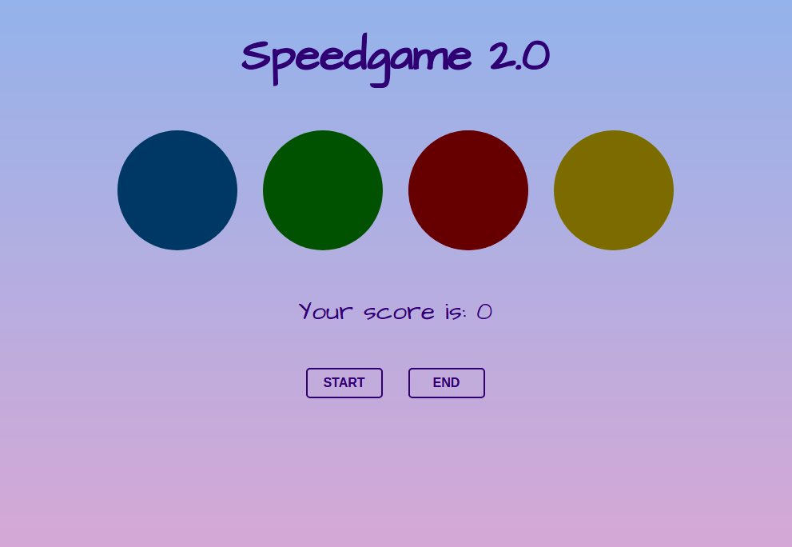

# Speedgame react app

## Project overview:

Instead of adding visual eyecandy and sounds to the project I focused on making the game functionality better.

In the example the game mechanics were flawed in a couple of ways:

-The game would get too fast after a while and was impossible to play after reaching a certain point. -> I added a cap for the speed of the game so that the speed of game won't go outside humans physical capabilities.
-The player could miss allways 4 presses as long as the fifth active button was pressed on correct time. This was caused because the game had a counter of missed presses which were resetted on every correct press. -> I fixed this error by adding an array of correct order so that the game will queue correct order. If this array would get longer than 5 elements, game ends.

